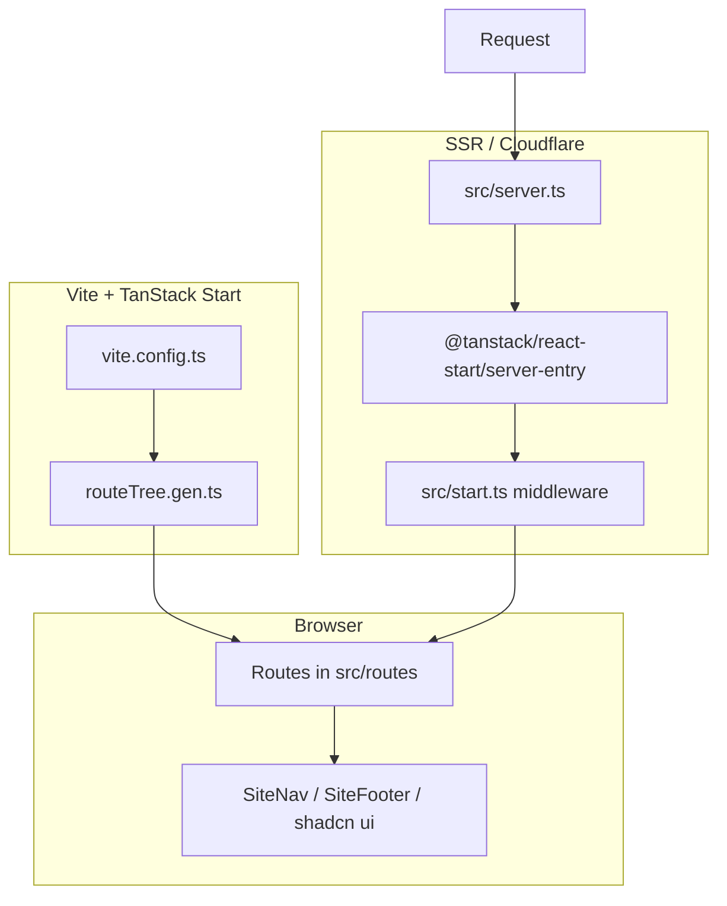

# Alpaca Bloom Studio — Cursor Migration Guide

This document describes the **Alpaca** marketing site codebase (exported from [Lovable.dev](https://lovable.dev)), what still ties it to Lovable, and how to run and own it locally in Cursor or any editor.

> **Migration status:** Path B is applied in this repo — `@lovable.dev/vite-tanstack-config` removed, standard `vite.config.ts` in place, `.lovable/` deleted, social meta images point to `/og-image.png`, and placeholder files exist under `src/assets/`. Run `npm install` (or `bun install`) then `npm run dev` on your machine.

---

## Codebase overview

### What this app is

A **Spanish-language creative studio marketing site** for “Alpaca Creative Studio” — portfolio-style pages for services, projects, studio info, and contact. There is **no backend API**, database, or auth. The contact form only updates local React state (no email is sent).

### Tech stack

| Layer | Technology |
|--------|------------|
| Framework | [TanStack Start](https://tanstack.com/start) (React 19 + SSR) |
| Routing | [TanStack Router](https://tanstack.com/router) (file-based routes) |
| Build | [Vite 7](https://vite.dev) |
| Styling | [Tailwind CSS v4](https://tailwindcss.com) + `tw-animate-css` |
| UI primitives | [shadcn/ui](https://ui.shadcn.com) (Radix + `components.json`) |
| Icons | `lucide-react` |
| Data fetching | `@tanstack/react-query` (wired in router; pages are mostly static) |
| Deploy target (configured) | **Cloudflare Workers** via `@cloudflare/vite-plugin` + Wrangler |
| Package manager (lockfile) | **Bun** (`bun.lock`) — npm/pnpm also work |

### Directory structure

```
.
├── .lovable/                 # Lovable project metadata (safe to remove)
├── src/
│   ├── routes/               # File-based pages (TanStack Router)
│   │   ├── __root.tsx        # HTML shell, nav/footer, global SEO meta
│   │   ├── index.tsx         # Home
│   │   ├── servicios.tsx
│   │   ├── proyectos.tsx
│   │   ├── estudio.tsx
│   │   └── contacto.tsx
│   ├── components/
│   │   ├── site-nav.tsx
│   │   ├── site-footer.tsx
│   │   └── ui/               # shadcn components (large set; mostly unused on pages)
│   ├── assets/               # ⚠️ Expected images — see “Missing assets” below
│   ├── lib/                  # utils, SSR error helpers
│   ├── hooks/
│   ├── router.tsx            # Router factory + React Query client
│   ├── routeTree.gen.ts      # Auto-generated — do not edit
│   ├── start.ts              # TanStack Start instance + error middleware
│   ├── server.ts             # Cloudflare Worker entry (custom SSR error wrapper)
│   └── styles.css            # Tailwind v4 + brand tokens
├── vite.config.ts            # Uses Lovable’s Vite wrapper today
├── wrangler.jsonc            # Cloudflare Workers config
├── components.json           # shadcn config
├── package.json
└── bun.lock
```

### Routes

| Path | File | Purpose |
|------|------|---------|
| `/` | `src/routes/index.tsx` | Hero, services preview, featured work |
| `/servicios` | `src/routes/servicios.tsx` | Service sections (hash links: `#digital`, `#interior`, `#btl`) |
| `/proyectos` | `src/routes/proyectos.tsx` | Project grid |
| `/estudio` | `src/routes/estudio.tsx` | About the studio |
| `/contacto` | `src/routes/contacto.tsx` | Contact form (client-only mock submit) |

### Application flow



### Lovable-specific touchpoints (inventory)

| Item | Location | Role |
|------|----------|------|
| `@lovable.dev/vite-tanstack-config` | `package.json`, `vite.config.ts` | Bundles TanStack Start, React, Tailwind, Cloudflare, path aliases, dev HMR bridge, component tagger |
| `lovable-tagger` | Transitive dependency | Dev-only component tagging for Lovable editor |
| `@lovable.dev/vite-plugin-dev-server-bridge` | Transitive | Proxies dev server for Lovable cloud IDE |
| `@lovable.dev/vite-plugin-hmr-gate` | Transitive | HMR behavior in Lovable sandbox |
| `.lovable/project.json` | `.lovable/` | Template name / schema only |
| Lovable CDN URLs | `src/routes/__root.tsx` | `og:image` / `twitter:image` hosted on `*.r2.dev` with `lovable.app` in filename |

**Not present:** Supabase, Firebase, Lovable API keys, `VITE_*` env usage in source, or runtime calls to Lovable services. Disconnecting is primarily a **build-tooling and asset/hosting cleanup**, not ripping out app logic.

### Missing assets (important)

Several routes import images from `@/assets/` (e.g. `hero-llama.jpg`, `service-digital.jpg`). **This export does not include `src/assets/`**, so `bun run dev` / `vite build` will fail until you restore them:

- Re-download the project from Lovable (full export), or  
- Copy `src/assets` from the original repo, or  
- Replace imports with your own images under `src/assets/`.

Expected files (from imports):

- `hero-llama.jpg`
- `service-digital.jpg`, `service-interior.jpg`, `service-btl.jpg`
- `work-branding.jpg`, `work-hotel.jpg`, `work-festival.jpg`
- `studio.jpg`

---

## Quick start (local dev with Lovable config still installed)

Fastest path: keep `@lovable.dev/vite-tanstack-config` temporarily — it runs fine outside Lovable; you are not required to call Lovable APIs.

### Prerequisites

- **Node.js 20+** (22 LTS recommended)
- **Bun** (optional; repo has `bun.lock`) or npm/pnpm

### Steps

1. **Open the project** in Cursor (this folder as workspace root).

2. **Install dependencies**

   ```bash
   bun install
   # or: npm install
   ```

3. **Restore `src/assets/`** (see above). Without this, the dev server will not start.

4. **Start the dev server**

   ```bash
   bun run dev
   # or: npm run dev
   ```

5. Open the URL Vite prints (often `http://localhost:5173` or `3000` depending on config).

6. **Lint / format** (optional)

   ```bash
   bun run lint
   bun run format
   ```

7. **Production build** (local check)

   ```bash
   bun run build
   bun run preview
   ```

### Cloudflare local preview (optional)

Requires [Wrangler](https://developers.cloudflare.com/workers/wrangler/) and a Cloudflare account for deploy — not required for day-to-day UI work.

```bash
npx wrangler login
bun run build
npx wrangler dev
```

---

## Step-by-step: disconnect from Lovable

Use **Path A** for minimum change, **Path B** when you want zero `@lovable.dev/*` packages.

### Path A — Pragmatic (recommended first)

Goal: develop locally and deploy without changing Vite, while removing Lovable-only metadata and CDN links.

| Step | Action |
|------|--------|
| 1 | Complete **Quick start** and confirm the site runs. |
| 2 | Delete or git-ignore `.lovable/` (only contains `project.json` template metadata). |
| 3 | In `src/routes/__root.tsx`, replace `og:image` and `twitter:image` URLs with your own image (e.g. `/og-image.png` in `public/` or an asset under `src/assets/`). |
| 4 | Add `public/og-image.png` (or similar) and reference it in meta tags. |
| 5 | Commit the repo to **your** Git remote (GitHub/GitLab) — stop relying on Lovable as source of truth. |
| 6 | Deploy via Cloudflare (`wrangler deploy`) or another host (see [Hosting](#hosting-after-migration)). |

You can defer removing `@lovable.dev/vite-tanstack-config` until Path B.

### Path B — Full removal of Lovable npm packages

Goal: standard TanStack Start + Vite config with no Lovable plugins (no dev-server bridge, no `lovable-tagger`).

#### Step 1 — Remove the Lovable devDependency

```bash
bun remove @lovable.dev/vite-tanstack-config
# or: npm uninstall @lovable.dev/vite-tanstack-config
```

#### Step 2 — Replace `vite.config.ts`

The Lovable wrapper currently registers (among other things): `tanstackStart`, `viteReact`, `@tailwindcss/vite`, `vite-tsconfig-paths`, `@cloudflare/vite-plugin`, path alias `@/*`, and your custom server entry.

Replace the entire file with a standard config. **Keep** the custom `server: { entry: "server" }` so `src/server.ts` remains the Worker entry (matches `wrangler.jsonc` `main`).

```ts
import { defineConfig } from "vite";
import { tanstackStart } from "@tanstack/react-start/plugin/vite";
import { cloudflare } from "@cloudflare/vite-plugin";
import tailwindcss from "@tailwindcss/vite";
import viteReact from "@vitejs/plugin-react";
import tsconfigPaths from "vite-tsconfig-paths";

export default defineConfig({
  server: {
    port: 3000,
    strictPort: false,
  },
  resolve: {
    // Alternative to tsconfigPaths plugin; use one or the other
    // tsconfigPaths: true,
  },
  plugins: [
    cloudflare({ viteEnvironment: { name: "ssr" } }),
    tsconfigPaths(),
    tailwindcss(),
    tanstackStart({
      server: { entry: "server" },
    }),
    viteReact(),
  ],
});
```

**Plugin order matters:** `cloudflare` → `tanstackStart` → `viteReact` last (per TanStack + Cloudflare docs).

#### Step 3 — Add Wrangler as a dev dependency (if you deploy to Cloudflare)

```bash
bun add -D wrangler
```

Add scripts to `package.json` if you want:

```json
"deploy": "vite build && wrangler deploy",
"cf-typegen": "wrangler types"
```

#### Step 4 — Verify

```bash
bun run dev
bun run build
bun run preview
```

Fix any missing plugin or path errors (`@/*` should match `tsconfig.json` paths).

#### Step 5 — Clean up Lovable artifacts

- Delete `.lovable/`
- Update social meta images in `__root.tsx`
- Run `bun install` and commit the updated lockfile

#### Step 6 — Optional: align `wrangler.jsonc` with TanStack defaults

Lovable uses a **custom** `src/server.ts` for branded SSR error pages. Keep:

```jsonc
"main": "src/server.ts"
```

TanStack’s vanilla Cloudflare example uses `"main": "@tanstack/react-start/server-entry"`. Only change this if you drop the custom error wrapper in `src/server.ts` and `src/start.ts`.

### What you can delete vs keep

| Remove | Keep |
|--------|------|
| `.lovable/` | `src/server.ts`, `src/start.ts`, `src/lib/error-*.ts` (app-specific SSR error UX) |
| `@lovable.dev/vite-tanstack-config` (Path B) | `@cloudflare/vite-plugin`, `wrangler.jsonc` (if staying on Cloudflare) |
| Lovable `og:image` URLs | `src/components/ui/*` (shadcn; harmless if unused) |

---

## Hosting after migration

The project is already set up for **Cloudflare Workers**:

- `wrangler.jsonc` → `main`: `src/server.ts`
- Build output consumed by Wrangler after `vite build`

**Deploy (Cloudflare):**

```bash
npx wrangler login
bun run build
npx wrangler deploy
```

**Other platforms:** Follow [TanStack Start hosting](https://tanstack.com/start/latest/docs/framework/react/guide/hosting) — e.g. Netlify (`@netlify/vite-plugin-tanstack-start`), Vercel/Railway via Nitro, or Node with Nitro. Each target needs its own Vite plugin and may use a different `wrangler.jsonc` / server entry.

---

## Environment variables

There are **no required `.env` files** in the current source. The Lovable Vite wrapper can inject `VITE_*` variables if you add them later:

1. Create `.env.local` (gitignored via `*.local` in `.gitignore`)
2. Prefix client-exposed vars with `VITE_`
3. Access via `import.meta.env.VITE_*`

Server-only secrets on Cloudflare belong in Wrangler secrets / `.dev.vars` (also gitignored).

---

## Cursor-specific workflow tips

1. **Index the repo** — Open the project root so `@/` path intelligence matches `tsconfig.json`.
2. **Generated file** — Do not hand-edit `src/routeTree.gen.ts`; it regenerates when the dev server runs.
3. **Editing UI** — Pages live in `src/routes/`; shared chrome in `site-nav.tsx` / `site-footer.tsx`. shadcn components are under `src/components/ui/`.
4. **Contact form** — To send real email, add a TanStack Start server function or an external API (Formspree, Resend, etc.); wire `contacto.tsx` `onSubmit` to that endpoint.
5. **Rules** — Consider a `.cursor/rules` file for brand tokens (`styles.css`) and Spanish copy conventions.

---

## Checklist summary

- [ ] Install dependencies (`bun install` or `npm install`)
- [x] Placeholder `src/assets/` images added (replace with real photos)
- [ ] `bun run dev` — site loads on all routes
- [x] Lovable CDN social preview images replaced with `/og-image.png`
- [x] `.lovable/` removed
- [x] Path B applied: standard `vite.config.ts`, `@lovable.dev/vite-tanstack-config` removed
- [ ] Push to your own Git repository
- [ ] Configure deployment (Cloudflare or other)
- [ ] (Optional) Implement real contact form backend

---

## Reference: scripts in `package.json`

| Script | Command | Purpose |
|--------|---------|---------|
| `dev` | `vite dev` | Local development with HMR + SSR |
| `build` | `vite build` | Production client + server bundles |
| `build:dev` | `vite build --mode development` | Development-mode build |
| `preview` | `vite preview` | Preview production build locally |
| `lint` | `eslint .` | Lint TypeScript/React |
| `format` | `prettier --write .` | Format codebase |

---

## Troubleshooting

| Problem | Likely cause | Fix |
|---------|----------------|-----|
| Cannot resolve `@/assets/...` | Missing `src/assets` folder | Add images from Lovable export or your own files |
| Port already in use | Another dev server | Change `server.port` in `vite.config.ts` or stop the other process |
| Duplicate plugin errors after Path B | Plugins listed twice | Ensure only one of `tsconfigPaths()` or `resolve.tsconfigPaths` |
| `wrangler dev` fails | Not built / wrong `main` | Run `vite build` first; keep `main` as `src/server.ts` if using custom server |
| Blank page / SSR error | Build or route issue | Check terminal for SSR errors; inspect `src/server.ts` error handling |

---

*Generated for migrating **alpaca-bloom-studio** from Lovable.dev to local development in Cursor.*
